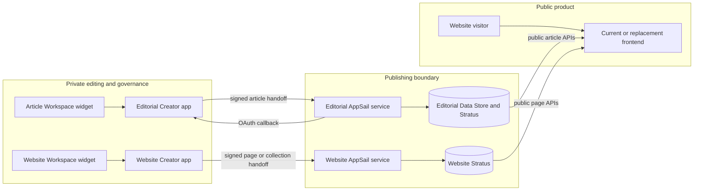
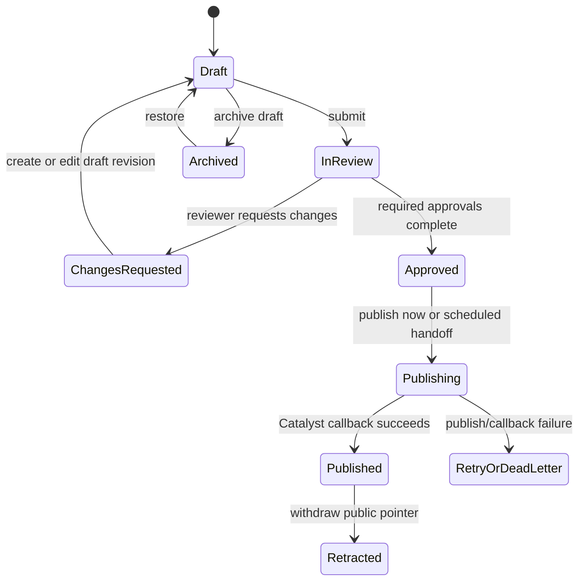
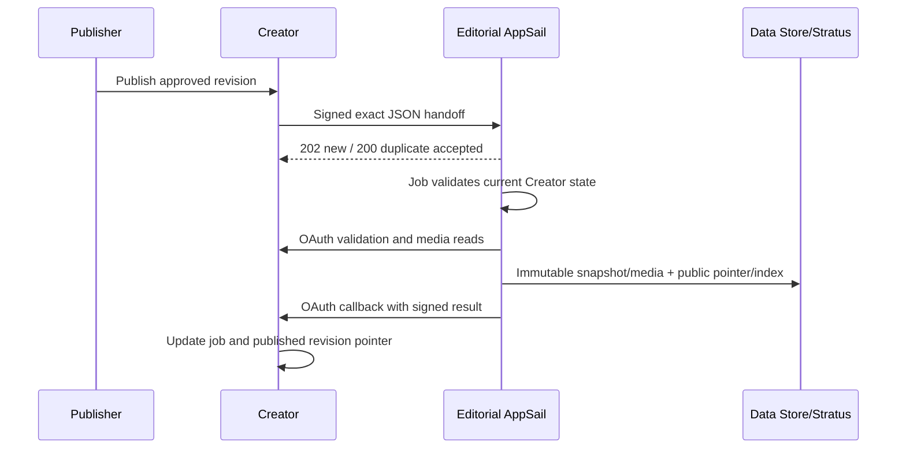

# GeneDrift Product Engineering, Migration and Deployment Guide

**Document date:** 1 October 2026  
**Purpose:** give a new engineer enough context to understand, migrate, deploy, operate and extend the GeneDrift website and editorial platform without forcing them to reuse the current public frontend.  
**Companion:** [Deployment record template](GENEDRIFT_DEPLOYMENT_RECORD_TEMPLATE.md)

## 1. Read this first

GeneDrift is one public product with two private content-management applications and two publishing services:

1. **Editorial CMS** manages articles, revisions, review, approval, media, schedules, publication jobs and audit history.
2. **Website CMS** manages ordinary website pages and structured collections such as markets, case studies, navigation, footer and offices.
3. **Catalyst editorial publisher** converts approved article data into safe public article documents, media and indexes.
4. **Catalyst website publisher** publishes structured website pages and collections.
5. **Public website** reads the public Catalyst APIs. The current implementation is Next.js, but a replacement frontend may consume the same contracts.

Zoho Creator is the private control plane. Catalyst is the public publishing boundary. The website is the presentation layer. A Creator `.ds` file is not the live content database, and the website never reads a DS file or widget ZIP at runtime.



This diagram shows the recommended responsibility boundaries. It does not require two Catalyst accounts, two domains or the current frontend.

## 2. Source locations and precedence

Use these logical roots throughout this guide:

| Name | Current local location | Meaning |
|---|---|---|
| `P` | `/Users/piyushtyagi/.codex/.chatgpt-projects/g-p-6a8889a848888191b2ad25dd63f743ee` | Editorial platform source and historical documentation |
| `W` | `/Users/piyushtyagi/Downloads/genedrift-web` | Current public website, website CMS widget, Creator functions and website publisher |

Paths are machine-specific. In client infrastructure, record the new repository URLs and checkout paths in the companion deployment record.

When documents conflict, use this order:

1. current source code and dependency lockfiles;
2. this guide and a completed deployment record;
3. the newest dated checkpoint or handover;
4. older plans and design proposals.

Important exceptions:

- `P/web/` is a stale moved copy. Do not deploy or edit it. The current website is `W`.
- `P/frontend/` is an earlier frontend implementation. It is reference material, not a required deployment dependency.
- `W/context/integration.md`, `W/BUILD-GUIDE.md` and `W/cms-architecture.md` describe earlier proposals in places. The implemented website CMS uses the current forms and source described below.
- A ZIP filename, package version or old checkpoint is not proof that the same build is installed in Creator or Catalyst. Record source commit, artifact hash, installation time and live evidence separately.

## 3. What every major folder does

### Editorial platform (`P`)

| Path | Responsibility |
|---|---|
| `creator/Genedrift_Editorial_Platform_Production.ds` | Creator application schema/configuration baseline. It does not contain stored records or uploaded file contents. |
| `creator/functions/*.deluge` | Workflow, review, taxonomy, publication, scheduling, callbacks, archive and notification logic. |
| `creator/*.md` | Manual Creator setup for imports, permissions, workflows, seeding and Catalyst publishing. |
| `editor-widget/` | React/TypeScript Article Workspace embedded in Creator using Creator Widget SDK v2. |
| `editor-widget/src/repository/` | Creator SDK data adapter plus development mock adapter. Production requires the live Creator SDK. |
| `editor-widget/zet/` | ZET widget package manifest and build output location. |
| `catalyst/` | Editorial Node/Express AppSail service, storage adapters, public API, security checks and tests. |
| `catalyst/src/snapshot.ts` | Converts Tiptap JSON to sanitised published HTML. This file defines actual publication-format support. |
| `catalyst/test/` | Publishing, security, media and public-read tests. |
| `docs/` | Checkpoints, architecture notes, audits and this handover. |

### Current website (`W`)

| Path | Responsibility |
|---|---|
| `app/`, `components/` | Current Next.js public site and its page/section components. A future frontend may replace these. |
| `components/sections/` | Typed renderers and schemas for structured website sections. |
| `lib/content/` | Catalyst clients, API-to-view mapping, sanitisation, caching and fallback behaviour. |
| `app/insights/` | Current article listing and detail routes. |
| `app/api/revalidate/route.ts` | Protected website cache invalidation for website pages/collections. |
| `lib/forms/submit.ts` | Server-side contact form submission to Creator. |
| `creator/*.deluge` | Website page and collection publishing functions plus lookup-linking utilities. |
| `widget/` | Website Workspace Creator widget. It edits friendly form fields over `Website_Pages` and `Website_Sections`. |
| `scripts/emit-schemas.ts`, `scripts/emit-fields.ts` | Generate shared public schemas and widget field definitions from the frontend schemas. |
| `scripts/sync-catalyst-types.mjs` | Copies generated section types into the website publishing service. |
| `services/catalyst-website/` | Separate synchronous website publishing AppSail service. |
| `context/` | Current handover, CMS specifications, client blockers and cutover notes. |

## 4. Creator DS files, records, widgets and Deluge

### What a DS file contains

A DS file is the text representation of a Creator application's components: forms, fields, reports, pages, functions, workflows, schedules and settings. It does **not** contain the application's stored records. Zoho also notes that images embedded in pages and print templates are not stored in the DS export. See [Zoho's DS file documentation](https://help.zoho.com/portal/en/kb/creator/developer-guide/application-settings/application-ide/articles/understand-ds-file).

Therefore a complete backup or migration needs all of the following:

- a fresh DS/schema export;
- exported records for every form;
- actual file-field contents, including revision JSON files and media files;
- widget source and the exact installed widget ZIP;
- Deluge source and Custom API definitions;
- schedules, connections, application variables and permission configuration;
- Catalyst source, data, object storage, environment configuration and deployment evidence;
- DNS, frontend environment and hosting configuration.

Never treat `P/creator/Genedrift_Editorial_Platform_Production.ds` as a current full backup unless its export time and source account have been recorded.

### What the widgets do

Both widgets are embedded web applications loaded inside Creator. They call `window.ZOHO.CREATOR.DATA` through the Creator Widget SDK v2. They provide a safer, clearer interface over Creator records; they are not another database.

- The **Article Workspace** provides the rich article editor, media picker, review actions, taxonomy and publication controls.
- The **Website Workspace** converts structured `Section_Data` JSON into labelled editing fields. It intentionally locks page structure, layout and section order.

The editorial body is stored in `Article_Revisions.Editor_Document` as an attached JSON file. The report may show only a filename. The JSON is read by the widget and the publishing service. `Plain_Text_Extract` supports reporting/search, but it is not the authoritative rich body and cannot preserve headings, links, lists or media.

A native Creator edit form is not a replacement for the Article Workspace rich editor. Directly editing an approved revision or its JSON attachment can bypass the normal immutable-review model. Production permissions should make technical and approved-revision fields read-only for normal users.

### Widget build and installation

Editorial widget validation commands:

```bash
cd P/editor-widget
npm ci
npm run typecheck
npm test
npm run build
cd zet
../node_modules/.bin/zet validate
../node_modules/.bin/zet pack
```

Website widget validation commands:

```bash
cd W
npm ci
npm run build
cd widget
npm ci
npm run build
```

The website widget README refers to `widget/flow.mjs`, but that file is currently absent. Do not claim that preview flow passed until the test is restored or the flow is tested another way.

For every widget release, record the source revision, build command, ZIP SHA-256, Creator app, widget name, index path and installation time. Re-uploading is required when widget source or generated website section fields change.

## 5. Editorial data and workflow

The editorial Creator app contains 17 forms:

`Demo_Employees`, `Demo_Teams`, `Demo_Team_Memberships`, `Editorial_Role_Assignments`, `Approval_Policies`, `Articles`, `Article_Contributors`, `Article_Revisions`, `Review_Assignments`, `Review_Comments`, `Categories`, `Tags`, `Media_Assets`, `Publication_Jobs`, `Redirects`, `Audit_Events`, and `Site_Settings`.

The important design is identity separate from content:

- `Articles` owns the article UUID, workflow state, people/taxonomy relationships and pointers to active, approved and published revisions.
- `Article_Revisions` owns a versioned title, slug, excerpt, rich editor JSON, checksum, SEO fields and calculated text/count fields.
- `Media_Assets` owns files and publication-safe metadata such as alternative text.
- `Review_Assignments` and `Review_Comments` hold review work and decisions.
- `Publication_Jobs` tracks asynchronous publishing and callback status.
- `Audit_Events` records important actions.



Approval does not make an article public. Publication is successful only after Catalyst persists the public version/pointer and the authenticated callback updates Creator.

`Demo_Employees` and `Demo_Teams` are currently used as real lookup sources across the app. For client production, decide whether to keep them as the internal directory, rename display labels only, or integrate a client employee system. Changing Creator link names is a schema migration, not a cosmetic rename.

### Known editorial gaps that must not be hidden

- `Article_Revisions.Slug` is required but cannot be globally unique because multiple revisions of one article legitimately share it. The missing rule is: no other article's public revision may use the same slug. Add an approval/publish-time check or reservation before production.
- `Article_Contributors.Show_Publicly` does not currently reach the public API, so the website has no public byline/author contract.
- There is no public content-type filter. The public URL is currently `/insights/{slug}` and filters are category/tag names. Confirm URL and content-type strategy before launch.
- The current rich editor supports more formatting than `catalyst/src/snapshot.ts` publishes. Published HTML supports paragraphs, H2-H6, basic inline marks and links, blockquotes, lists, horizontal rules and media images. Tables, highlight, subscript, superscript and alignment require renderer/sanitiser work or must be disabled before production.
- `Redirects` and `Site_Settings` exist in Creator, but the public API does not currently expose redirects and not every setting drives the service.
- `publishedAt` in the public API is the current public version time. `First_Published_At` is not exposed.
- Retraction removes the article from normal public serving, but immutable public objects/media may remain reachable if their direct object URLs are known. Define retention and privacy requirements.

## 6. Editorial Catalyst service

The editorial service is an asynchronous, idempotent publishing boundary.



The service uses these seven Data Store tables; exact columns are documented in `P/catalyst/README.md`:

- `GD_Publication_Requests`
- `GD_Published_Versions`
- `GD_Published_Pointers`
- `GD_Public_Index`
- `GD_Publication_Attempts`
- `GD_Callback_Outbox`
- `GD_Request_Nonces`

It uses a private Stratus bucket for snapshots and a public bucket for published article JSON/media. It also needs a Job Pool and AppSail jobs for publication and callback retry.

The HMAC signature covers uppercase method, exact request path, Unix timestamp, nonce and SHA-256 of the exact raw request body. A proxy must not rewrite a signed path or reserialise the JSON body before verification. Timestamps and durable nonces enforce freshness/replay protection.

The Creator-to-Catalyst signing secret and Catalyst internal-job secret must be different, at least 32 characters, generated per environment and stored only in managed secret/configuration stores. The previously exposed editorial signing secret must be rotated before client cutover. Creator callbacks also require OAuth; possession of the signing secret alone should not grant the callback API.

### Public editorial read API

| Method/path | Current contract |
|---|---|
| `GET /health` | Process liveness only. It is not a dependency health check. |
| `GET /health/config` | Shows whether required configuration is present. Review how much configuration identity should be public. |
| `GET /v1/public/articles?page=&limit=&q=&category=&tag=` | `{ ok, articles, pagination, facets }`; limit is clamped to 1-50. Category/tag filters use names, not slugs. |
| `GET /v1/public/articles/{slug}` | `{ ok, article, pointer }`; article includes sanitised `html`, metadata and media. |
| `GET /v1/public/taxonomy` | Public categories/tags. |
| `GET /v1/public/sitemap.xml` | Indexable article URLs. |
| `GET /v1/public/rss.xml` | Public article RSS. |

An unknown valid slug returns 404. An invalid slug returns 400. A retracted article returns 410 with retraction metadata. Conflicting public slug ownership can return 409. The public API serves sanitised HTML, not raw `Editor_Document` JSON.

The API currently has no public author, content-type or redirects endpoint. Do not promise those to a frontend engineer until the contracts are added.

### Editorial configuration inventory

Record values in a secret manager, never in this guide or Git. Required groups are:

- publication: `PUBLISHING_HMAC_SECRET`, `INTERNAL_JOB_SECRET`;
- Stratus: `CATALYST_STRATUS_PRIVATE_BUCKET`, `CATALYST_STRATUS_PUBLIC_BUCKET`, `CATALYST_STRATUS_PUBLIC_BASE_URL`;
- AppSail/jobs: `CATALYST_JOBPOOL_NAME`, `CATALYST_APPSAIL_NAME`, `CATALYST_APPSAIL_BASE_URL`, job and callback paths;
- public site: `PUBLIC_SITE_BASE_URL`;
- Creator: API/DC base URL, account owner, app/report/file link names, environment, callback and validation Custom API URLs;
- Creator OAuth: client ID, client secret, refresh token and correct regional token URL;
- retry/security limits: clock skew, leases, attempts, backoff, pointer CAS attempts and maximum media bytes.

The source accepts older `GD_...` aliases for several Catalyst names. Prefer canonical names and remove conflicting duplicates. `CREATOR_ENVIRONMENT` is a Creator endpoint choice; it is not proof that Catalyst itself is a production deployment.

## 7. Website CMS and publisher

The website CMS uses a lighter model because normal website content does not need the article review/revision engine.

- `Website_Pages` holds path, internal title, page family, status, SEO, owner, live publication ID and timestamps.
- `Website_Sections` holds the page relationship, order, section type, structured JSON data, hidden/required flags and notes.
- Collection forms cover markets/capabilities, case studies/metrics, navigation, footer, certifications and offices.
- Country services exist in source but are on hold; do not activate them simply because a later artifact contains the code.

The Website Workspace edits section data through generated labelled forms. It is a structured CMS, not a drag-and-drop page builder. The current Creator adapter has fallback owner/app identifiers, including the existing account and `genedrift-website`; these must be configured or changed for the client account and verified live.

The website publishing service accepts a signed complete snapshot and responds synchronously. It stores immutable publication JSON and mutable live pointers in one private Stratus bucket. It has no Data Store, job pool, Creator OAuth callback or retry outbox.

Public website endpoints include:

- `GET /v1/public/pages`
- `GET /v1/public/pages/_root`
- `GET /v1/public/pages/{path}`
- `GET /v1/public/markets`
- `GET /v1/public/case-studies`
- `GET /v1/public/site`
- `GET /v1/public/country-services` only if that held feature is deliberately released

Publishing endpoints include signed page/collection publication and rollback/unpublish routes. The current security check enforces request freshness but does not persist nonces, so an identical signed request may be replayed within the allowed clock-skew window. Add durable nonce/idempotency protection or formally accept and test the risk before production.

Other website-publisher risks to test:

- a page pointer and shared index are separate writes, so partial failure or concurrent publishes can cause inconsistency;
- storage read failures may appear as missing content in some paths;
- normal users need narrow Creator permissions and publishing authority—editorial role checks are not automatically inherited;
- website rollback changes public storage, so Creator's `Live_Publication_ID` and working content must also be reconciled.

Website publisher configuration is deliberately small: `WEBSITE_HMAC_SECRET`, `CATALYST_STRATUS_PRIVATE_BUCKET`, `REQUEST_CLOCK_SKEW_SECONDS`, `MAX_PAYLOAD_BYTES` and the AppSail listening port. Use a secret independent from the editorial HMAC secret.

## 8. Current frontend and replacement-frontend contract

The current public frontend is Next.js 16 with React 19. It reads two independently configured API origins:

- `CATALYST_API_BASE_URL` for editorial articles;
- `CATALYST_WEBSITE_API_BASE_URL` for website pages and collections.

The code also uses `NEXT_PUBLIC_SITE_URL`, an indexability switch, Creator contact/careers configuration, image-host allowlists and a protected cache-revalidation secret. Inspect `W/lib/content/` and `W/app/api/revalidate/route.ts` before deployment.

A new frontend—Jinja2, React, Next.js or another server-rendered stack—is acceptable if it preserves these behaviours:

1. renders only the public APIs, never private Creator APIs in a visitor's browser;
2. safely handles article HTML and never injects unsanitised external HTML;
3. maps 404, 409 and 410 correctly, especially retraction;
4. preserves canonical URLs, robots metadata, sitemap/RSS and redirects;
5. uses stable media URLs and an explicit media-host policy;
6. has bounded caching and a tested invalidation/retraction path;
7. shows service failure separately from “no content” where operationally important;
8. does not expose Creator private links, OAuth tokens or publication signing secrets.

Current limitations to carry into frontend planning:

- article cache invalidation is not wired into the website revalidation route; article appearance/retraction can wait for cache expiry;
- development fallbacks can show fixture content when APIs are absent; production must have a deployment gate that proves real CMS content is configured;
- website page/collection fallbacks are built-in copy, not guaranteed last-known-good CMS data;
- `next.config.ts` media remote patterns must include the target production media host;
- the contact form checks Creator's success code, and careers URLs/field mappings are credential-like configuration that must be transferred securely;
- the adverse-event flow remains intentionally disabled pending client ownership and routing decisions.

Hostinger currently documents Node.js application deployment on eligible Business and Cloud plans using GitHub integration or a ZIP upload. Confirm the client's exact plan and supported Node version before selecting it for this SSR Next.js application; see [Hostinger's Node.js deployment guide](https://www.hostinger.com/support/how-to-deploy-a-nodejs-website-in-hostinger/). Hosting the website on Hostinger does not move Creator or Catalyst into Hostinger.

## 9. Catalyst topology choices

Zoho documents that one Catalyst project can contain multiple AppSail services. See [AppSail basics](https://docs.catalyst.zoho.com/en/serverless/help/appsail/appsail-basics/). That makes consolidation possible, but it is a deployment choice—not a requirement for presenting one website.

| Option | What it means | Benefit | Cost/risk | Recommendation |
|---|---|---|---|---|
| A. Two Catalyst projects, two services | Current logical shape, recreated under client ownership | Strong isolation, fewest code/config changes, independent releases | Two projects to operate | **Recommended for the first client migration** |
| B. One Catalyst project, two AppSail services | Editorial and website services share a Catalyst project but remain separate apps | One project/console while preserving code boundaries | Reprovision storage/tables/jobs; verify service-scoped config and permissions | Good later consolidation option |
| C. One Catalyst project, one combined AppSail service | Merge route sets into one codebase/process | One service endpoint/process | New engineering project; body limits, secrets, jobs, storage and failure domains must remain separated | Do only for a measured operational reason |
| D. One public gateway, separate services behind it | One public API hostname routes to existing backends | Simplifies frontend origin and can preserve isolation | Gateway becomes another security/cache component | Useful if “one API address” is the actual client goal |

The client decision should answer three separate questions:

1. Do they want one ownership/console location?
2. Do they want one public API hostname?
3. Do they require one running service/codebase?

Those are different outcomes. For the initial transfer, choose A unless the client has a clear reason for B. Consider D if the frontend team only needs one API address. Do not create C by combining ZIPs; it requires design, implementation and a full regression release.

If choosing B, preserve independent HMAC secrets, buckets, route namespaces and release pipelines. Confirm whether the Catalyst console can scope each configuration variable to the intended AppSail service; rename variables if shared project-level names would collide.

## 10. Client migration runbook

Complete every stage and record evidence in the companion template.

### Stage 0 — ownership and decisions

- Identify client owners for Creator, Catalyst, domain/DNS, Hostinger, source control, security, content and incident response.
- Confirm Zoho data centre/region and exact account/app link names.
- Select Catalyst topology A/B/C/D and document why.
- Decide article URL/content-type rules, author/byline requirements, redirects ownership and retention of old public objects.
- Define target recovery point, recovery time and rollback decision owner.

**Success:** every production system has a named client owner and unresolved product decisions are listed with dates.

### Stage 1 — freeze and inventory the source

- Freeze schema and publishing changes for the migration window.
- Export fresh DS files and Creator backups.
- Export every form with record counts and stable UUIDs.
- Download every `Editor_Document`, media `Draft_File` and other file field; calculate hashes.
- Inventory widgets, Custom APIs, variables, connections, permissions, schedules and live link names.
- Inventory Catalyst tables, buckets/objects, job pools, AppSail apps, schedules and configuration names.
- Build source artifacts from a known source revision; record hashes. Do not promote a mystery ZIP.
- Revoke/rotate exposed credentials, including the previously shared editorial signing secret and any historical deployment tokens, at the correct cutover stage.

**Success:** an encrypted, restorable inventory exists and contains no secrets in Git or chat.

### Stage 2 — build the target Creator applications

- Import the DS/schema into the client Creator account.
- Install the exact widgets and verify index paths.
- Recreate Custom APIs, connections, variables, schedules, permission profiles and sharing manually where import did not preserve them.
- Import parent records before children. Preserve UUIDs; do not preserve old Creator numeric IDs as authority.
- Use a two-pass import for cyclic relationships, then rewrite lookup/pointer fields to target Creator record IDs.
- Upload actual revision JSON and media files and verify hashes.
- Replace demo directory/role mappings with approved client identities.
- Seed policies/roles only after reviewing the seed script; do not seed development users into production.

Large Creator record IDs must remain strings in JavaScript and migration maps.

**Success:** record/file counts reconcile, references resolve, and role-negative tests prove unauthorised users cannot review or publish.

### Stage 3 — provision target Catalyst

Editorial service:

- create the seven Data Store tables exactly as defined in `P/catalyst/README.md`;
- create private/public Stratus buckets and verify public policy only for intended objects;
- create Job Pool/AppSail job targets and retry schedules;
- configure target Creator regional API, owner, app/report/file names and OAuth;
- deploy a clean runtime artifact and verify startup/config without logging secret values.

Website service:

- create its private Stratus bucket;
- configure a new independent signing secret;
- deploy the website publisher and verify page/collection endpoints.

For either topology, use separate development and production configuration. Catalyst environment promotion does not imply that Creator records or Catalyst data were automatically copied; verify each data set.

**Success:** services start, dependencies are reachable, signed invalid/replayed/stale requests are rejected as designed, and unsigned write routes are inaccessible.

### Stage 4 — reconcile publication state

Choose and document one strategy:

- **Fresh republish:** import Creator records/files, then republish approved content into new Catalyst storage. This creates new publication times/IDs unless specifically preserved.
- **Historical copy:** copy immutable public objects and serving state with a verified identity/URL migration plan. Old Creator record IDs inside historical objects and old public hosts need explicit handling.

Do not clone active job leases, request nonces or half-finished callbacks. Freeze schedules, drain/reconcile jobs, list every future schedule, then recreate only deliberately authorised schedules in the target.

**Success:** each expected public article/page resolves from the target, no duplicate scheduler can fire, and old/new storage responsibilities are clear.

### Stage 5 — configure the public frontend

- Point editorial and website API variables to target production endpoints.
- Configure canonical site URL, media allowlists, indexability, contact/careers settings and revalidation secret.
- Remove or gate development fixture fallbacks for production.
- Build with the repository command (`npm run build`), because it generates schemas and widget fields before Next.js builds.
- If section types changed, regenerate fields/schemas and synchronise Catalyst types before rebuilding both website widget and publisher.
- Deploy to the approved Hostinger plan or another Node-capable host.

**Success:** frontend source is replaceable, but its deployed contract passes the same content, SEO, retraction, media and error tests.

### Stage 6 — end-to-end acceptance

Test at least:

- author creates and saves a rich article; reviewer claims and approves; publisher publishes;
- unauthorised author cannot approve/publish; reviewer cannot alter approved content;
- duplicate handoff is idempotent; same key with changed body is rejected;
- expired timestamp/replayed nonce behaviour matches the documented contract;
- callback outage retries and reaches the outbox/dead-letter state visibly;
- scheduled publish fires once at the expected timezone;
- revoked or stale approval cannot publish;
- slug collision across two articles is blocked before public conflict;
- JPEG, PNG, GIF and WebP files publish with correct type, dimensions, hash and alt text;
- every permitted editor feature survives publication, or unsupported controls are disabled;
- listing, detail, taxonomy, sitemap and RSS contracts are correct;
- article retraction becomes 410 within the accepted cache window;
- website root uses `_root`; pages and collections publish consistently;
- website unpublish/rollback and Creator reconciliation work;
- production displays real CMS content, not fixtures;
- monitoring traces one action through audit event, Creator job, request ID, publication ID and callback event.

**Success:** attach timestamped evidence to the deployment record. Historical test notes are context, not evidence for this target environment.

### Stage 7 — cutover and rollback

- Lower DNS TTL in advance if required and preserve all email-related MX/SPF/DKIM/DMARC/TXT records.
- Take a final source export after the publishing freeze.
- Rotate production secrets and update both sides atomically.
- Switch frontend/API/DNS configuration, run smoke tests and monitor errors/jobs/callback outbox.
- Keep the previous frontend/API endpoints and backups available for the agreed rollback window.
- If rolling back website public content, also reconcile Creator's live publication pointer before the next publish.
- For editorial content, republish an approved prior revision through the workflow rather than manually rewriting the current pointer.

**Success:** client owner signs off, monitoring is quiet for the agreed observation period, and rollback evidence remains usable.

## 11. Build and release checks

Use dependency lockfiles. Do not infer a release from hard-coded health versions or package versions; current source contains version labels that do not match candidate ZIP names.

Editorial AppSail:

```bash
cd P/catalyst
npm ci
npm run typecheck
npm test
npm run build
```

Website frontend:

```bash
cd W
npm ci
npm run typecheck
npm run build
```

The current `npm run check` invokes `next lint`; confirm compatibility with the installed Next.js version before using it as the release gate. Do not skip typecheck/build because lint wiring is stale.

Website AppSail:

```bash
cd W/services/catalyst-website
npm ci
npm run typecheck
npm run build
```

Its `test/smoke.mjs` is a client for a running local service, not an automatic `npm test` suite. Run it against an isolated local store and controlled test configuration, then record the result.

Before uploading any runtime ZIP, list its contents and confirm it includes the required `package.json`, lockfile, compiled `dist` output and production dependencies according to the chosen AppSail packaging method. Confirm it contains no `.env`, token, private key, credential JSON or debug dump.

## 12. Security and operational requirements

Trust boundaries are Creator users, the two Creator applications, their widgets, AppSail write APIs, Creator callbacks/OAuth, Catalyst storage, the public APIs and the frontend host.

Minimum production controls:

- unique secrets per service and environment, managed outside source/export files;
- least-privilege Creator profiles, internal role mappings and OAuth scopes;
- exact raw-body HMAC verification, timestamp checks and durable replay prevention;
- no secret values or credential-bearing Creator links in browser bundles, logs, guides or tickets;
- storage policy audit for both public and private buckets;
- monitoring for retries, dead letters, callback outbox, pointer/index mismatch and public API failures;
- backups that include schema, records and files, plus a tested restore;
- release manifest tying source, artifact hashes, installed targets and tests together;
- dependency/security update ownership for both AppSail services and the frontend.

Never expose full content payloads, OAuth responses, signatures or secrets in operational logs. Log identifiers sufficient to trace the workflow: article/revision UUID, Creator job ID, request ID, publication ID, callback event ID and outcome.

## 13. Future features, including AI writing

AI is not required to complete the current forms architecture. Add it later as a draft-producing client of the existing workflow:

1. a user supplies a brief, source material and constraints;
2. the AI service returns a schema-validated draft document and proposed metadata;
3. the system creates or updates a **draft** revision only;
4. the user checks sources, claims, media rights, taxonomy and regulatory language;
5. the ordinary review, approval and publishing workflow remains authoritative.

Do not allow an AI integration to write approved/published pointers, call internal jobs, bypass permissions or publish directly. Store provider/model/prompt policy and provenance if the client requires auditability. Client decisions are needed for approved AI provider, data residency, confidential input rules, retention, human review and regulated-content responsibility.

## 14. Current readiness statement

The architecture is sound: article identity is separate from revision content, publication is idempotent and auditable, callbacks are authenticated, media is verified, and public reads are separated from private editing. The website CMS also has a clear structured-content model.

It should not yet be represented as a completed client-production deployment. Before that claim, complete the migration record and close or accept these gates:

1. rotate all exposed credentials and verify environment separation;
2. implement cross-article slug ownership protection;
3. resolve editor-versus-publisher formatting mismatch;
4. decide and implement public authors, content type/URL rules and redirects if required;
5. add/accept website publish replay protection and concurrency recovery;
6. prove target least-privilege permissions, OAuth and end-to-end publication;
7. prove retraction/cache timing and direct-public-object retention policy;
8. identify exact installed widget/AppSail artifacts with hashes;
9. complete a target backup/restore and rollback exercise;
10. obtain the client's Catalyst topology and operational ownership decisions.

Once these checks are evidenced, another engineer can keep the current frontend or replace it without redesigning the private editorial workflow.

## 15. Client decisions to capture before provisioning

Record answers in the companion template:

- Catalyst topology A, B, C or D;
- one API hostname requirement, if any;
- Zoho data centre and client account/project owners;
- article URL/content-type/category relationship;
- public author/byline requirements;
- redirects ownership and old URL inventory;
- old publication history and public-object retention;
- Hostinger plan/runtime or alternative frontend host;
- production cache/retraction target;
- employee/directory source and final role matrix;
- country-services and adverse-event feature status;
- AI provider/data rules, if AI writing is later commissioned;
- RPO, RTO, rollback owner and support/incident contacts.

No one needs to decide the future frontend framework before transferring the CMS and publishing system. They do need to freeze the API/URL/security contracts that the chosen frontend will consume.

## 16. Current artifact and evidence snapshot

The files below are known local candidate artifacts. Their hashes identify the files only; they do not prove installation or live production readiness.

| Candidate | SHA-256 | Interpretation |
|---|---|---|
| `P/editor-widget/genedrift-editor-widget-production-candidate-v0.5.8.zip` | `a8757c36cdde3453a6c3b7c40d83b78810ef6bb085594dad451b31ae010f3b03` | Latest known editorial widget candidate. The last explicitly recorded live smoke evidence in the 7 September checkpoint was older, so verify the installed widget. |
| `P/genedrift-catalyst-appsail-candidate-v0.4.4-production-readiness.zip` | `28193fc5f566d751e3425a15054db9572b46d4c43260b3fbf4b91159f1c62e8b` | Editorial AppSail candidate. Inspect contents and rebuild from a named source revision before client deployment. |
| `W/genedrift-website-widget-v0.1.5.zip` | `694a075e2c3054daabc0d44a88d6e1b3edfe8e4f906d54dd0c45e973581f993a` | Website widget candidate. Confirm it matches generated fields and client Creator identifiers. |
| `W/genedrift-website-appsail-dev-v0.2.0.zip` | `1b426f0b5a800fb25cb6fedca61a1f0c84942750cf37676c306e0027651bd64d` | Website publisher development candidate before held country-services expansion. Rebuild for production. |

Never deploy `P/work_artifacts/production-review-2026-09-08/FAILED-clean-catalyst-production-runtime.zip`.

Historical notes report successful local test/build runs and several live Creator workflow exercises, but they are not a current certificate for the client environment. The 7 September checkpoint records an editorial OAuth publication incident as remediated without subsequent public-success evidence. Later website notes also report hosting/trial constraints. At handover, classify each component separately as **source present**, **artifact built**, **installed**, **live tested**, and **accepted for production**.

This guide was created from source inspection on 1 October 2026. No application code, live Creator configuration, Catalyst deployment, website deployment or production data was changed while producing it.
